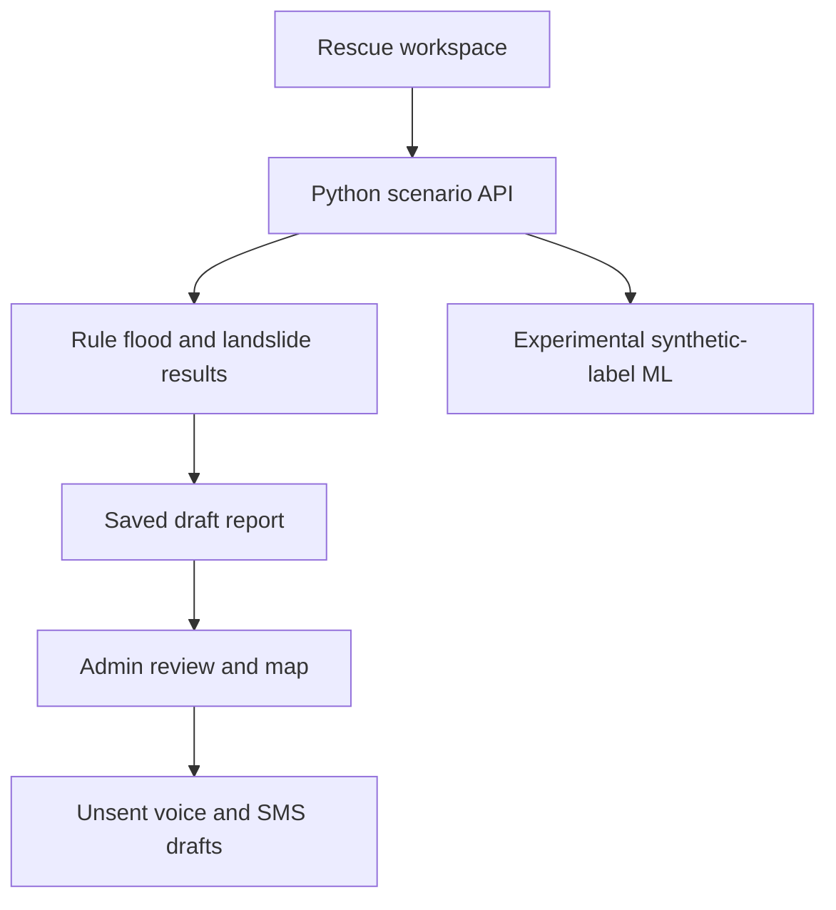
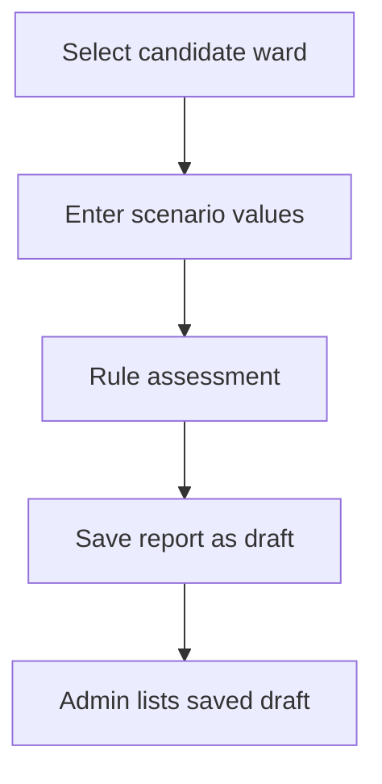
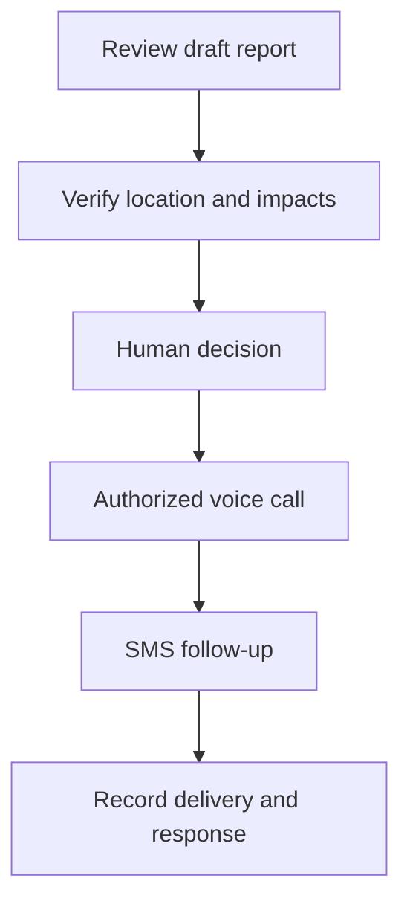

<h1 align="center">KERALA HAZARD REVIEW</h1>

<strong>Report-Led Flood and Landslide Scenario Platform</strong>

Ward Selection · Dual-Hazard Review · Local-Centre Reports · Voice-First Drafts

<strong>RESEARCH PROTOTYPE — NO LIVE WARNINGS</strong>

Local Demo
Workspace	Address	Purpose
Rescue simulation	http://127.0.0.1:5173/simulation	Select a candidate ward and run a scenario
Admin dashboard	http://127.0.0.1:5173/admin	View the map and saved draft reports
Backend health	http://127.0.0.1:8765/api/health	Check the Python server

These are localhost addresses, not public deployments. Start both servers as described under Running locally.
Table of Contents
- Overview
- Problem and Objectives
- Key Features
- Technology Stack
- System Architecture
- Project Modules
- Machine Learning and Data
- Current Status
- System Workflows
- Project Structure
- Running Locally
- API Routes
- Demonstration
- Existing Systems and References
- Feasibility and Future Work
- Responsible Use and Licence
Overview
Kerala Hazard Review demonstrates how a selected place, weather inputs, two hazard assessments, a saved local-centre report, and draft voice-first messages can be handled in one review workflow. It is a research and demonstration prototype. It does not reliably predict real disasters, verify evacuation routes, connect to physical IoT sensors, or transmit public warnings.
The prototype has two local applications: a Rescue simulation workspace and an Admin dashboard. The report is the central record: an assessment alone cannot tell a community where to go or prove that a warning reached anyone.
Problem and Objectives
Short warning times for flash floods and landslides create a need for area-specific evidence, local verification and clear communication. The project aims to:
1. Display flood and landslide scenarios for a selected local area.
2. Preserve the inputs, location, result, limitations and review status in a draft report.
3. Give a local centre a structured way to verify impacts, people, animals and safe routes.
4. Explore human-reviewed voice-first messaging with SMS follow-up and delivery evidence.
5. Test candidate models on real, independently verified events before making prediction claims.
Key Features
- Shows India and all 14 Kerala districts, with candidate ward boundaries currently prepared for Idukki, Wayanad, Kozhikode, Kottayam and Pathanamthitta.
- Lets a Rescue user select a candidate ward, set rainfall and soil moisture, and run separate flood and landslide rule scenarios.
- Displays a separate experimental ML response from two Random Forest classifiers trained on synthetic disaster labels.
- Saves each successful rule scenario as a draft report with its selected ward identity when available.
- Lets an Admin user view saved reports, a manually entered simulated sensor reading, and unsent message previews.
- Provides backend functions and API routes for demo local-centre assignment and acknowledgment. These actions record manual entries; they do not prove that a real officer received anything.
The Munnar Ward 18 example has been tested from Rescue scenario to saved report. Its ward boundary is marked CANDIDATE_UNVERIFIED.
Geographic view	Hazard assessment	Response preparation
India and 14 Kerala districts	Separate flood and landslide rule scenarios	Persisted draft reports
Candidate wards in five districts	Experimental synthetic-label Random Forest	Local-centre and responder text drafts
Selected candidate ward highlight	Manual simulated sensor reading	Voice-first and SMS follow-up drafts; no delivery

Technology Stack
Category	Technology in this prototype
Frontend	React, Vite, JavaScript, CSS
Interactive maps	React Leaflet, Leaflet, GeoJSON; Mapshaper for data preparation
Backend	Python standard-library HTTP server and JSON API
Data processing	pandas, NumPy, CSV and GeoJSON
Experimental machine learning	scikit-learn Random Forest; joblib model files
Local report storage	JSON files under data/processed/reports/
Simulated sensor storage	Local JSON file; manual demo input only
Communications	Message templates only; no voice or SMS provider connected

This project does not use FastAPI or a production database in its current form.
System Architecture

The experimental ML endpoint is displayed separately; it does not authorize alerts. The saved report records the rule scenario and candidate ward identity, if selected.
Project Modules

<strong>Rescue Simulation</strong>

Select a Kerala district and an available candidate ward, enter rainfall and soil moisture, and run a dual-hazard rule scenario. The frontend automatically saves a draft report after a successful rule simulation. A separate panel can display the experimental ML response.

<strong>Admin Dashboard</strong>

View India, Kerala districts and the selected candidate ward. The Admin view lists saved reports and also displays scenario-only previews and the latest manually entered simulated sensor reading. These panels currently duplicate some information; consolidating around the saved report is planned.

<strong>Reports and Local-Centre Review</strong>

The backend creates, lists and retrieves persistent draft reports. Demo routes can record a centre assignment and a manual acknowledgment. These routes do not authenticate a real officer and do not prove that a centre was contacted.

<strong>Voice-First Message Drafts</strong>

Templates prepare local-centre, resident voice, SMS follow-up and responder text. Recipient lists, destinations and routes remain unverified. Delivery states are NOT_ATTEMPTED; no alert has been sent.

Current Status
Area	Status
Kerala district map	14 districts shown
Candidate ward map	Five districts; not operationally verified
Historical weather preparation	401,645 hourly rows from five sampled locations, one per district; rainfall and modeled soil moisture
Flood and landslide rule scenarios	Working demonstration; thresholds are unvalidated
Random Forest models	Experimental; trained/tested against invented event labels
Sensor input	Manually submitted simulated reading; no physical device connected
Reports	Draft creation, local JSON storage, list, retrieval and demo review routes
Voice / SMS	Draft text only; delivery is NOT_ATTEMPTED
Authentication	Frontend demo gate only; backend review endpoints do not authenticate an officer

Do not deploy this backend on a public interface or use its results to issue real warnings.
Machine Learning and Data
The current Random Forest classifiers are experimental supervised classifiers for synthetic flood and landslide labels. Five weather features feed each model. They are not the source of the rule-based High/Medium/Low scenario levels.
Why the ML numbers are not operational predictions
The experimental models accept five numeric inputs: rainfall_12h_mm, rainfall_24h_mm, rainfall_7d_mm, soil_0_7cm_m3_m3, and soil_7_28cm_m3_m3. They produce separate flood and landslide scores. The event labels used for training were generated from invented rules, so strong synthetic-test scores show that the models learned those rules; they do not measure accuracy on observed disasters or establish a probability of an event. The scenario severity displayed by the rule simulation is separate from the ML scores.
Before any prediction claim, the project needs dated, located, independently verified event and non-event records; input data available before each event; geographic and time-based holdout tests; calibration; and evaluation of missed events, false alarms and usable lead time. A planned comparison is Logistic Regression, Random Forest and gradient-boosted trees on the same real-event test design.
System Workflows

<strong>Current demo workflow</strong>

The experimental ML panel is separate from this rule-to-report flow. The report remains a demonstration record and makes no claim of verified impact.

<strong>Planned local-centre and delivery workflow</strong>

Only draft generation and demo assignment are available today. There is no authorized delivery integration.

Project Structure
backend/
  server.py                Local JSON API
  simulation_rules.py      Demonstration flood/landslide rules
  experimental_ml.py       Experimental synthetic-label ML inference
  alert_templates.py       Unsent local-centre, voice, SMS and responder drafts
  report_review.py         Demo assignment and acknowledgment records
  models/                  Experimental model files, if available locally
frontend/
  src/                     React Rescue and Admin views
  public/maps/             India and Kerala GeoJSON assets
  public/wards/            Candidate ward GeoJSON and index
data/
  raw/                     Source files, subject to source terms and size
  processed/               Prepared features, reports and demo sensor state
The exact contents committed to GitHub may differ: large source rasters, downloaded datasets, model binaries, reports and local demo readings should be reviewed before committing. Do not commit contact lists, credentials or personal information.
Running Locally on Windows
Requirements: Python 3.13, Node.js/npm, the frontend dependencies, and the Python packages required by the ML/data modules. If a requirements.txt is present, use it; otherwise the experimental ML path needs compatible numpy, pandas, scikit-learn and joblib installations. The inference endpoint also needs its trained model files in backend/models/.
In one PowerShell window:
Set-Location 'D:\kai\kerala-warning'
py backend\server.py
In a second PowerShell window:
Set-Location 'D:\kai\kerala-warning\frontend'
npm install
npm run dev -- --host 127.0.0.1
Open http://127.0.0.1:5173/simulation for the Rescue demo and http://127.0.0.1:5173/admin for the Admin demo. Both use prototype-only frontend credentials defined in the app. Keep the backend listening on 127.0.0.1:8765; the Vite frontend forwards /api requests to it when configured as in this project.
Check the backend from another PowerShell window:
curl.exe --silent --show-error --noproxy "*" http://127.0.0.1:8765/api/health
Expected response: {"status":"ok","mode":"SIMULATION"}. If port 8765 already has an older Python process, stop that process before restarting server.py.
Main API Routes
Method and path	Purpose
GET /api/health	Local backend health
POST /api/simulate	Unvalidated rule scenario
POST /api/ml-experiment	Synthetic-label model response
GET /api/sensor-reading	Last manually submitted simulated reading
POST /api/sensor-reading	Save a simulated reading
POST /api/reports	Save a draft from a rule scenario
GET /api/reports	List saved draft summaries
GET /api/reports/{id}	Retrieve one saved draft
POST /api/reports/{id}/assign	Record a demo centre/officer assignment
POST /api/reports/{id}/acknowledge	Record a manual demo acknowledgment

These are local prototype routes. Assignment and acknowledgment do not send a call or SMS and do not verify the identity of a real officer. The report's voice and SMS delivery statuses remain NOT_ATTEMPTED.
Demonstration
Example: Munnar Town, Idukki. In the Rescue workspace, select the Munnar candidate ward (Ward 18), enter scenario rainfall and soil moisture values, and run the rule assessment. One tested high-rainfall scenario used 75 mm in 12 hours, 130 mm in 24 hours and soil moisture 0.48 m³/m³. It produced High flood and landslide demo results. A saved draft identified the selected candidate ward; Admin listed the report. No real event, impact or alert delivery was verified.
Demo centre review. A manual assignment route has been exercised with a demo centre name. An acknowledgment route is available; a manually entered acknowledgment must not be presented as a real officer's receipt without independent verification. Voice and SMS delivery remain NOT_ATTEMPTED.
Proposed operational workflow
1. Ingest quality-checked, time-stamped rain, soil, river and terrain data for a verified location.
2. Assess flood and landslide separately and retain the inputs, source timestamps and uncertainty.
3. Create a place-specific report for an authorized local centre.
4. Have the centre verify the affected area, people, animals, institutions, safe destinations and routes.
5. Require an authorized human decision on message wording and recipients.
6. If an authorized warning is warranted, send a voice/IVR message first, follow up by SMS, and record delivery, retry and acknowledgment outcomes.
Steps 4–6 are planned operational capabilities, not working public alert delivery. No safe route or recipient list is verified in the current prototype.
Relationship to Existing Warning Systems
India and Kerala already have official warning systems. The NDMA SACHET platform supports geo-targeted, multilingual dissemination, and KSDMA's KaWaCHaM integrates sensors, geospatial decision support and sirens. The IMD Kerala centre publishes official weather products. This prototype explores a report and review workflow; it is not an official replacement for these systems.
Data References
- KSDMA hazard maps — historical flood-probability products and GSI landslide-susceptibility layers. A susceptibility zone or return-period raster is not a live event prediction.
- Open-Meteo Historical Weather API — historical precipitation and modeled soil-moisture variables. Grid samples are not physical measurements in every ward.
- IMD Met Centre Thiruvananthapuram — official Kerala warning and forecast reference.
- NDMA SACHET and KSDMA KaWaCHaM — existing public alert systems to study for authorized future integration.
Review each dataset's provenance, accuracy, update time, licence and permissions before redistribution or operational use.
Feasibility and Future Work
Feasible now: a local, two-workspace demonstration that creates and retrieves a traceable draft report. Unproven for operations: true ward-level weather measurements, verified hazard labels, lead time, authenticated review, safe routes, recipient governance and delivery performance. Potential benefits—faster review, clearer evidence and more accessible communications—must be measured in supervised trials; they are not achieved outcomes.
Next Milestones
- Connect saved-report review status to the Admin interface and reduce duplicated scenario-only previews.
- Add structured field verification and auditable human decisions; keep message delivery disabled during prototype testing.
- Verify ward boundaries and spatial alignment of hazard layers; expand beyond five weather sample locations.
- Obtain real event labels, evaluate models on held-out dates and places, and test meaningful lead time.
- Specify recipient governance, multilingual voice/IVR, SMS, outage handling and delivery evidence with authorized local partners.
- Replace frontend demo access with proper backend authentication and security review before any deployment.
Responsible Use and Licence
All current hazard levels, reports and messages are demonstrations. Neither a synthetic-model score nor a candidate ward boundary is sufficient to trigger evacuation or communicate an official warning. Follow instructions from authorized disaster-management agencies.
No software licence has been selected for this repository. Add a LICENSE file after the team chooses one, and check third-party data licences separately before redistributing source datasets or map assets.

<strong>KERALA HAZARD REVIEW</strong> <em>From scenario to traceable local-centre draft</em>

